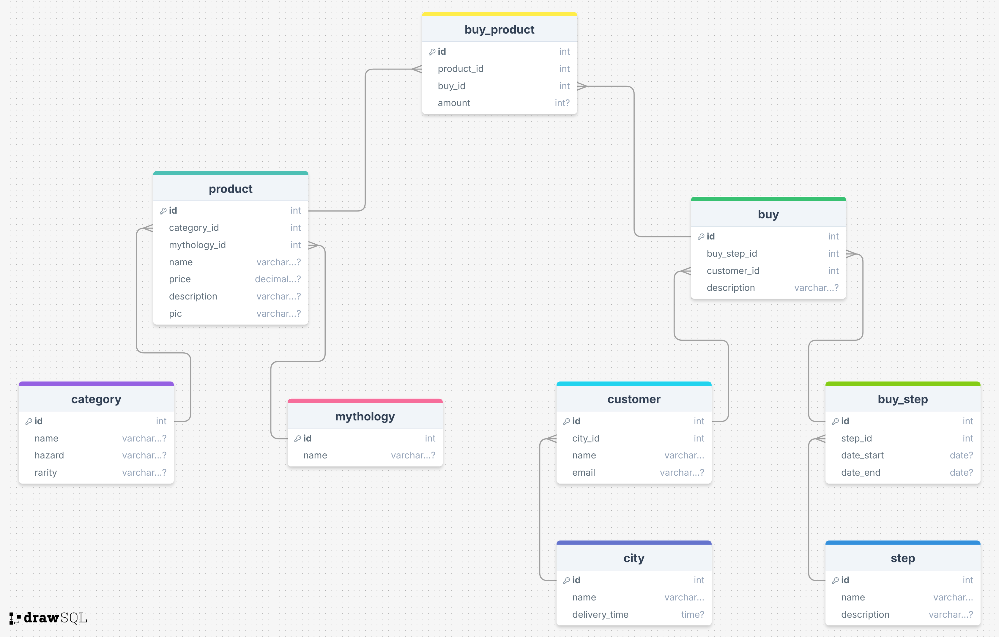

Разработка интернет магазина мифологической атрибутики Myth Mastery
===================

Предметная область:
-----------------
### Основные аспекты:
1) Мифология и фольклор. Товары классифицированы по принадлежности к конкретной культуре.
2) Товары четко типизованы. Категория также характеризована по редкости и опасности.
3) Процесс доставки наглядно представлен конкретными шагами и их длительностью.

Магазин призван упростить приобщение к горячо любимой культуре, расширить пути соприкосновения с этим миром.

Схема базы данных:
-----------------

Описание таблиц:
-----------------
| Имя таблицы | Описание                                                                                                                                                                            |        
|-------------|-------------------------------------------------------------------------------------------------------------------------------------------------------------------------------------|
| category    | Содержит список категорий, к которым могут принадлежать товары. Тут же представлены характеристики "редкость" и "опасность" товара.                                             |                                
| mythology   | Таблица содержит все мифологии, представленные в магазине.                                                                                                                          |
| product     | Содержит подробные описания конкретных товаров. Тут же содержится изображение товара и его цена. Таблицы **_category_** и **_mythology_** подвязаны сюда как **OneToMany**. |
| city        | Содержит список городов, доступных для доставки,  а также время доставки до них.                                                                                                |                                                                                                
| customer    | Содержит имена всех зарегистрированных покупателей и адреса их электронных почт.                                                                                                    |                                                                                                    
| step        | Содержит все стадии, которые проходит процесс доставки заказа.                                                                                                                      |                                                                                                                      
| buy         | Содержит сформированные заказы, их описание, стадию доставки и покупателя.                                                                                                          |                                                                                                          
| buy_step    | Реализует связь **ManyToMany** между таблицами **_buy_** и **_step_**.                                                                                                              |                                                                                                              
| buy_product | реализует связь **ManyToMany** между таблицами **_buy_** и **_product_**.                                                                                                           |                                                                                                           
